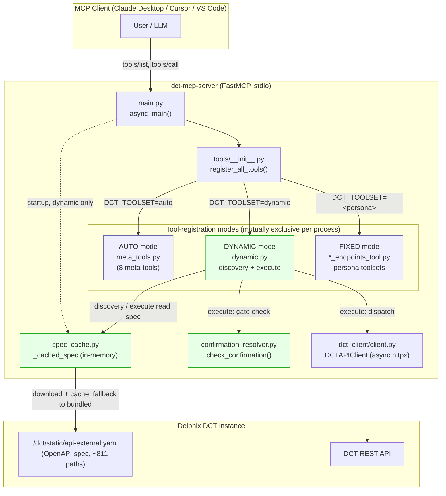
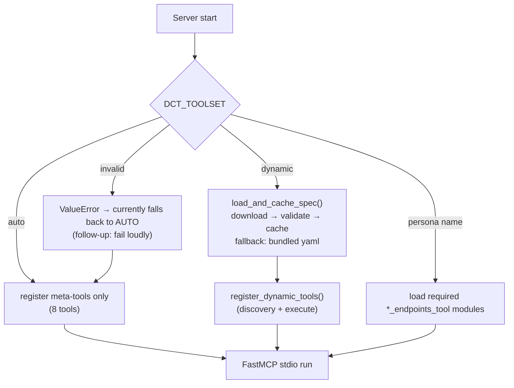
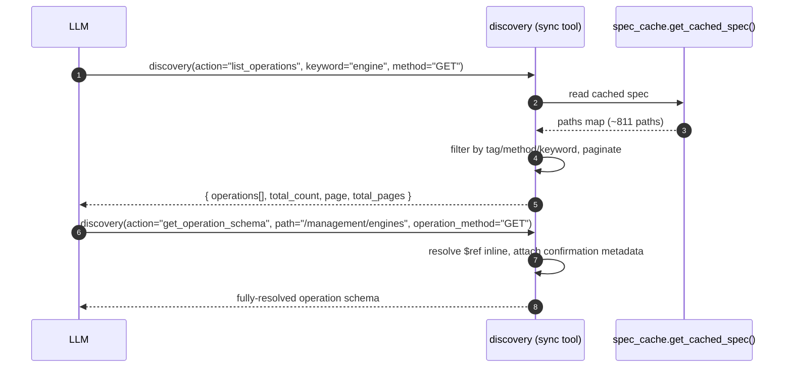
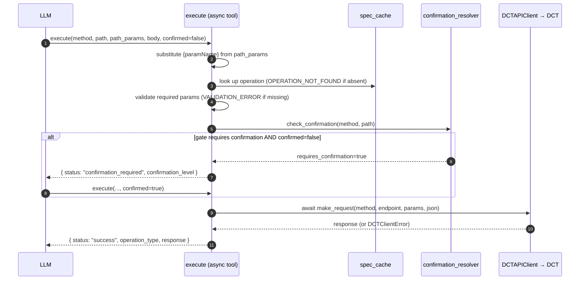
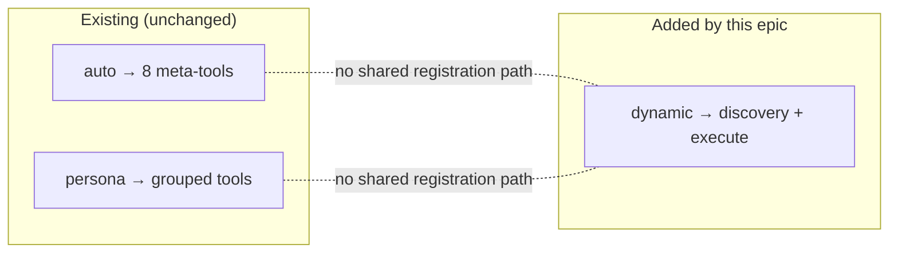
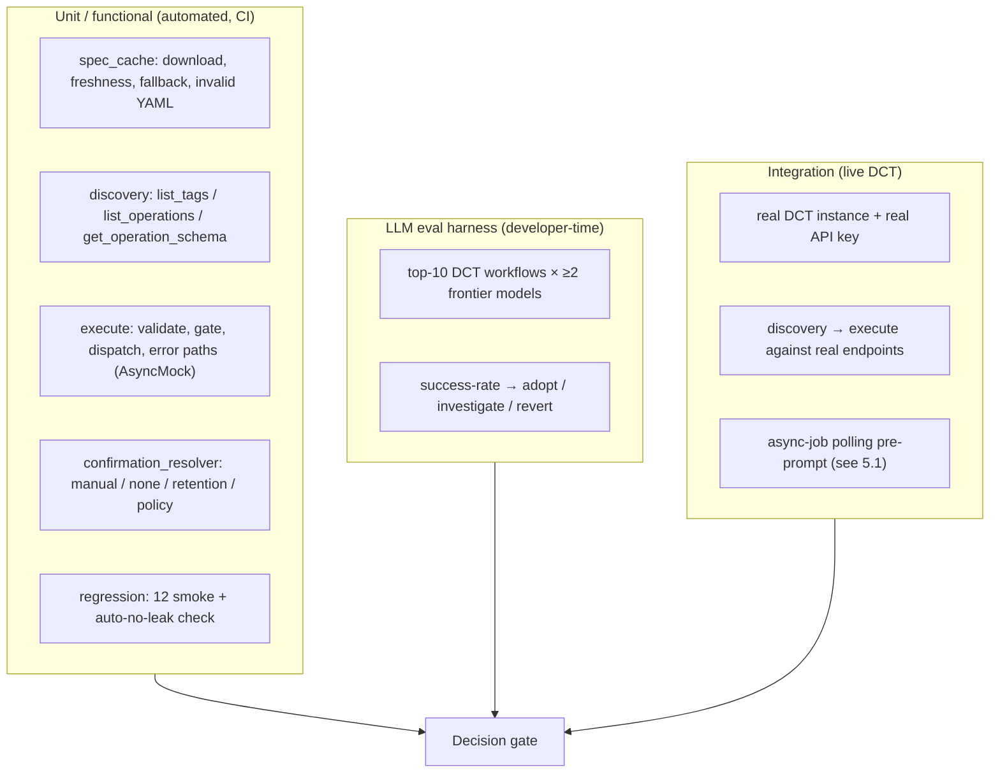
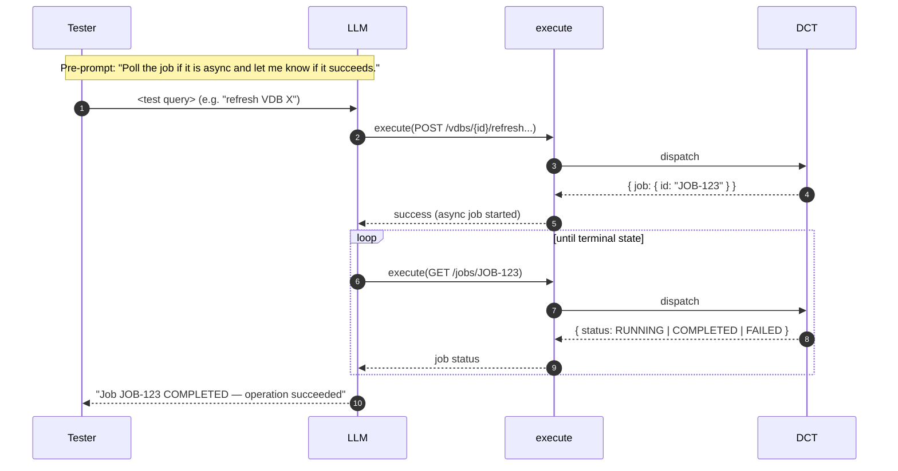

# DLPXECO-13984 — Epic Design: MCP Server 2-Tool (Dynamic) Architecture

> **Epic:** Ecosystem-MCP: MCP Server 2-Tool Revision (Phased — Full Delphix CRUD Support)
> **Source PPM:** PPM-1174
> **Scope of this doc:** Phase 1 architecture, high-level design, and test strategy for the **dynamic** (2-tool) mode, activated via `DCT_TOOLSET=dynamic`.

All diagrams below are [Mermaid](https://mermaid.js.org/) and render interactively in GitHub, the Jira/Confluence Mermaid macro, and most Markdown viewers.

---

## 1. Context & Goals

Today the MCP server exposes ~22 persona-based grouped tools, and each new DCT capability needs a code change. Phase 1 introduces a **dynamic mode** with exactly **2 tools** that are grounded entirely in the live DCT OpenAPI spec:

- **`discovery`** — browse the API surface (list tags, list operations with filters/pagination, fetch a fully-resolved operation schema).
- **`execute`** — validate parameters against the spec, apply the confirmation gate, and dispatch a single DCT API call.

**Design principle — additive, no regression:** dynamic mode is layered *on top of* the existing modes. `auto` mode and every fixed persona toolset remain byte-for-byte unchanged and must not regress. Only the new `DCT_TOOLSET=dynamic` value activates the new code path.

---

## 2. Architecture

**Legend:** green = new in this epic; blue = existing, unchanged (regression-protected).

**Key components**

| Component | New? | Responsibility |
|-----------|------|----------------|
| `tools/core/spec_cache.py` | New | Download → validate → disk-cache the OpenAPI spec; fall back to bundled `api-external.yaml`; hold parsed spec in a module-level cache read by both tools. |
| `tools/core/dynamic.py` | New | Implements `discovery` and `execute`; `register_dynamic_tools(app, dct_client)`. |
| `tools/core/confirmation_resolver.py` | New | Stateless `check_confirmation(method, path, context)` over `manual_confirmation.txt`. |
| `evals/llm_eval_harness.py` | New | Developer-time eval CLI (top-10 workflows, ≥2 models). |
| `config/config.py`, `config/loader.py`, `main.py`, `tools/__init__.py` | Modified (additive) | Recognize `DCT_TOOLSET=dynamic`; load spec at startup; route registration. |
| `meta_tools.py`, `*_endpoints_tool.py` | **Unchanged** | Auto + fixed modes — must not regress. |

---

## 3. High-Level Design

### 3.1 Startup & mode selection

> The `invalid → silent AUTO fallback` edge is a known UX gap captured as a follow-up (fail loudly on an unknown `DCT_TOOLSET`).

### 3.2 `discovery` flow

### 3.3 `execute` flow (with confirmation gate)

> **Async note (defect fixed):** `execute` is an `async` tool that `await`s `make_request`. The earlier synchronous `run_until_complete()` raised *"This event loop is already running"* under FastMCP's loop.

---

## 4. Mode Comparison — additivity guarantee

| Concern | Auto | Dynamic | Guarantee |
|---------|------|---------|-----------|
| Registration branch | `register_meta_tools_only()` | `register_dynamic_tools()` | Separate branches in `register_all_tools()`; no overlap |
| Tools exposed | 8 meta-tools | exactly 2 (`discovery`, `execute`) | Verified: dynamic tools never appear in auto |
| Spec source | per-tool generation / persona configs | `spec_cache` | Independent |
| Regression test | 12 smoke tests + auto registration check | 39 feature tests | All green (51/51) |

---

## 5. Test Strategy

**Current status:** 51/51 unit tests pass (39 feature + 12 regression). LLM eval harness is developer-time (requires live DCT + model API keys). Integration testing is performed against a live DCT instance.

### 5.1 Integration testing on a live DCT instance

Integration tests run with `DCT_TOOLSET=dynamic` against a real DCT instance, exercising real `discovery` → `execute` round-trips. Many DCT mutating operations are **asynchronous** — they return a `job` that must be polled to determine success.

To avoid the tester having to manually locate the right job/status endpoint and interpret results, **every integration-test user query is prefixed with a standard pre-prompt**:

> **Pre-prompt (prepended to every integration test query):**
> *"Poll the job if it is async and let me know if it succeeds."*

This instructs the LLM to, after any `execute` that returns a job reference, automatically discover and call the job-status endpoint (e.g. `GET /jobs/{jobId}`) via `discovery` + `execute`, poll until the job reaches a terminal state, and report success/failure — without manual endpoint lookup by the tester.

**Integration test checklist**
- Server starts in `DCT_TOOLSET=dynamic`; exactly `discovery` + `execute` are listed.
- `discovery` returns real tags/operations from the live spec.
- Read operations (e.g. `GET /management/engines`) return live data.
- Mutating operations honor the confirmation gate (first call → `confirmation_required`; `confirmed=true` dispatches).
- Async operations are polled to a terminal state via the pre-prompt convention and the outcome is reported.
- Auto mode and at least one fixed persona toolset still start and serve tools (no regression).

---

## 6. Decision Gate

Primary go/no-go signal is the LLM success rate on the top-10 workflows (target ≥ 80%). Secondary signals: confirmation-gate fidelity and OCTO spec-quality scoring. See `DLPXECO-13984-decision-gate.md`. Phase 2 (Search tool + Execute sandbox) is gated by Phase 1 validation **and** PPM-1129.

---

## 7. Open Follow-ups

- Fail loudly on an unknown `DCT_TOOLSET` instead of silently falling back to `auto`.
- Coverage on new modules is 77% (gate disabled per `testing.md`); raise toward 80%.
